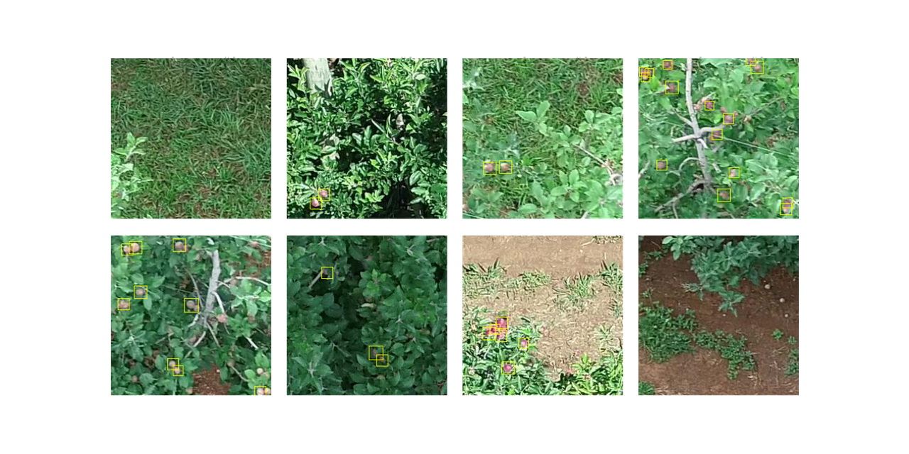

Embrapa Apples by Drones Detection Dataset (Embrapa ADD 256)
================================================================

This is a detailed description of the dataset, a data sheet for the dataset as proposed by [Gebru *et al.*](https://arxiv.org/abs/1803.09010)

Motivation for Dataset Creation
-------------------------------

### Why was the dataset created?

Embrapa ADD 256 (*Apples by Drones Detection Dataset — 256 × 256*) was created
to provide images and annotation for research on *apple detection in orchards for UAV-based monitoring in apple production. 

### What (other) tasks could the dataset be used for?

Apple detection in *low-resolution scenarios*, similar to the aerial
images employed here.

### Who funded the creation of the dataset?

The building of the ADD256 dataset was supported by the Embrapa SEG
Project 01.14.09.001.05.04, *Image-based metrology for Precision
Agriculture and Phenotyping*, and [FAPESP](https://fapesp.br/) under 
grant (2017/19282-7).

Dataset Composition 
-------------------

### What are the instances? 

Each instance consists of an RGB image and an annotation describing apples 
locations as _circular markers_ (i.e., presenting **center and radius**).

### How many instances of each type are there? 

The dataset consists of 1,139 images containing 2,471 apples. 

### What data does each instance consist of? 

Each instance contains an 8-bits RGB image. Its corresponding annotation
is found in the JSON files: each apple marker is composed by its center (cx, cy)
and its radius (in pixels), as seen below:

    "gebler-003-06.jpg": [
      {
        "cx": 116,
        "cy": 117,
        "r": 10
      },
      {
        "cx": 134,
        "cy": 113,
        "r": 10
      },
      {
        "cx": 221,
        "cy": 95,
        "r": 11
      },
      {
        "cx": 206,
        "cy": 61,
        "r": 11
      },
      {
        "cx": 92,
        "cy": 1,
        "r": 10
      }
    ],

`Dataset.ipynb` is a Jupyter Notebook presenting a code example for reading 
the data as a PyTorch's Dataset (it should be straightforward to adapt the code
for other frameworks as Keras/TensorFlow, fastai/PyTorch, Scikit-learn, etc.)

### Is everything included or does the data rely on external resources? 

Everything is included in the dataset.

### Are there recommended data splits or evaluation measures? 

The dataset comes with specified train/test splits. The splits are found
in lists stored as JSON files.

  |         |  Number of images  | Number of annotated apples |
  | ---     | ---                | ---                        |
  |Training | 1,025              |  2,204                     | 
  |Test     |   114              |    267                     |  
  |Total    | 1,139              |  2,471                     |             

*Dataset recommended split.*

Standard measures from the information retrieval and computer vision
literature should be employed: precision and recall, *F1-score* and
average precision as seen in [COCO](http://cocodataset.org)
and [Pascal VOC](http://host.robots.ox.ac.uk/pascal/VOC).

### What experiments were initially run on this dataset? 

The first experiments run on this dataset are described in *A methodology for detection 
and location of fruits in apples orchards from aerial images* by Santos & Gebler (2021).

Data Collection Process 
-----------------------

### How was the data collected?

The data employed in the development of the methodology came from a plot located
at the Embrapa’s Temperate Climate Fruit Growing Experimental Station at Vacaria-RS
(28°30’58.2”S, 50°52’52.2”W). Plants of 
the varieties _Fuji_ and _Gala_ are present in the dataset, in equal proportions. The images were 
taken during December 13, 2018, by an UAV (DJI Phantom 4 Pro) that flew over the rows of 
the field at a height of 12 m. The images mix nadir and non-nadir views, allowing a more extensive view of the 
canopies. A subset from the images was random selected and 256 × 256 pixels *patches* were extracted.

### Who was involved in the data collection process?

T. T. Santos and L. Gebler captured the images in
field. T. T. Santos performed the annotation.

### How was the data associated with each instance acquired?

The circular markers were annotated using the [VGG Image Annotator (VIA)](https://www.robots.ox.ac.uk/~vgg/software/via/).

Data Preprocessing
------------------

### What preprocessing/cleaning was done? 

No preprocessing was applied.

Dataset Distribution
--------------------

### How is the dataset distributed?

The dataset is [available at GitHub](https://github.com/thsant/add256).

### When will the dataset be released/first distributed?

The dataset was released in October 2021.

### What license (if any) is it distributed under?

The data is released under [**Creative Commons BY-NC 4.0 (Attribution-NonCommercial 4.0 International license)**](https://creativecommons.org/licenses/by-nc/4.0/). 
There is a request to cite the corresponding paper if the dataset is used. For
commercial use, contact Embrapa Agricultural Informatics business office.

### Are there any fees or access/export restrictions?

There are no fees or restrictions. For commercial use, contact Embrapa
Agricultural Informatics business office.

Dataset Maintenance
-------------------

### Who is supporting/hosting/maintaining the dataset?

The dataset is hosted at Embrapa Agricultural Informatics and all
comments or requests can be sent to [Thiago T. Santos](https://github.com/thsant)
(maintainer).

### Will the dataset be updated?

There is no scheduled updates. 

### If others want to extend/augment/build on this dataset, is there a mechanism for them to do so?

Contributors should contact the maintainer by e-mail.

### No warranty

The maintainers and their institutions are *exempt from any liability,
judicial or extrajudicial, for any losses or damages arising from the
use of the data contained in the image database*.

